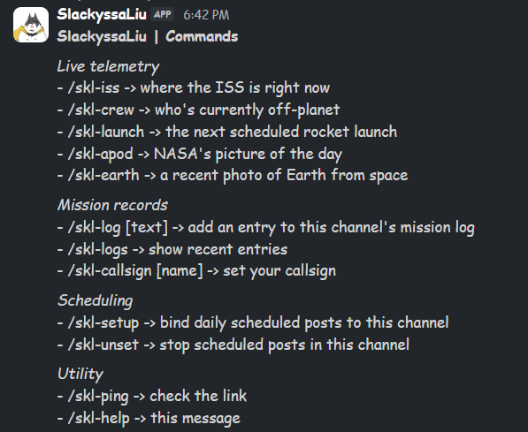

# SlackyssaLiu

  > **[Come spam /skl-ping in Slack (Live Demo)](https://hackclub.enterprise.slack.com/archives/C0C12D221KR)**

## Why this exists
When I first started, this was a general-purpose Slack bot following the prescribed mission guide and I had maybe 1-2 commands different from what most people were building. It looked like basically every other Slack bot out there and I wanted something unique. Something with a different perspective not the same thing so many people were already doing.

I tried a few themes before landing on this one. Figure skating was my first idea but there were barely any APIs to work with. Then I tried a medieval theme but ran into the same problem. I would've had to scrape Wikipedia manually which felt too tedious. And so I eventually went with my most interesting hobby: space. Interestingly enough, it was feasible because there were actually usable free APIs so I ultimately stuck with it.

This runs entirely via Slack's Socket Mode, meaning there's no public HTTP endpoint or webhook tunneling required. It also uses SQLite to remember channel-specific mission logs, custom user callsigns and which channels want daily scheduled posts.

## Screenshots

### APOD Image Embed 

### ISS Tracking 

### EPIC Earth Photo 

## Commands

Once you /invite @SlackyssaLiu to a channel, you can use a bunch of slash commands to pull live space data, log channel activity or bind scheduled posts to that channel.

Here are the commands straight from the bot's `/skl-help` response:

(Note: The bot only asks for `commands`, `chat:write` and `files:write` scopes. No admin or read permissions required!)

## The hard parts

Getting this bot actually deployed and rendering media was an absolute nightmare. Here are a few things I had to hack around:

### The Hosting & Dependency Hell

1. I assumed Nest would auto-deploy from GitHub like Vercel or Railway. Nope. It’s just a raw Linux VPS. I had to manually SSH in, only to find out git status was lying to me. it said "up to date" because it was comparing against a stale fetch from weeks earlier.

2. Once I finally pulled the code, `npm install` failed with a `node-gyp` error (Error: not found: make) because the server was missing C/C++ build tools (build-essential) needed to compile better-sqlite3. Even after fixing that, the bot kept crashing with a generic `Exit Code 1`. I had to dig through journalctl logs just to realize the fixed npm install hadn't actually been re-run yet.

### The API & Media War

1. **The APOD Video Problem:** Slack doesn't have a native video block for raw `.mp4` URLs. When NASA posts a video, the bot has to download it and stream it directly to Slack using `filesUploadV2`. I had to use `responseType: "stream"` so it wouldn't crash the server's RAM on large files. YouTube links get parsed and rendered natively.

2. **The Dead Mars API:** I originally built a `/skl-mars` command but the Mars Rover API backend deprecated and started silently returning GitHub 404 HTML pages which crashed Axios. I replaced it with the EPIC Earth API but I had to write logic to pull from random historical dates so it wouldn't just spam the same 13 photos over and over.

3. **Dead ISS APIs:** The primary Open Notify API goes down frequently so I wrote try/catch fallbacks with 5-second timeouts to route to `wheretheiss.at` so the telemetry commands don't just fail without doing anything

4. **Node 17+ DNS Bug:** Nest doesn't fully support IPv6 routing which Node 17+ defaults to. I had to add `dns.setDefaultResultOrder('ipv4first')` to stop it from throwing `ENOTFOUND` errors when trying to reach NASA.

## What I'm most proud of

The scheduled jobs are probably my favorite part! One notifies the channel daily with NASA's picture of the day and another checks for upcoming launches and notifies the channel before one happens. And also I ended up ripping out the hardcoded `.env` channel routing and moved it to SQLite. Now you can just type `/skl-setup` in any channel and the bot will dynamically start posting daily updates there. It makes the bot feel alive instead of just waiting for slash commands.

## Things to keep in mind

- **ISS & Crew APIs:** The primary Open Notify API is community-run and occasionally goes offline. If it fails or returns non-JSON, the bot automatically falls back to `wheretheiss.at` and `howmanypeopleareinspacerightnow.com`.

- **Timezones:** Cron jobs run on server time. You may need to adjust the schedule in `scheduler.js` depending on your server's timezone.

## The Stack & The Thanks

The whole thing is built on Node.js and Slack Bolt running in Socket Mode using Axios to wrangle the APIs, `better-sqlite3` for local memory and `node-cron` for the scheduled stuff. It originally started from Stardance's mission guide but the deployment headaches, broken APIs and media rendering bugs were 100% original (for real)